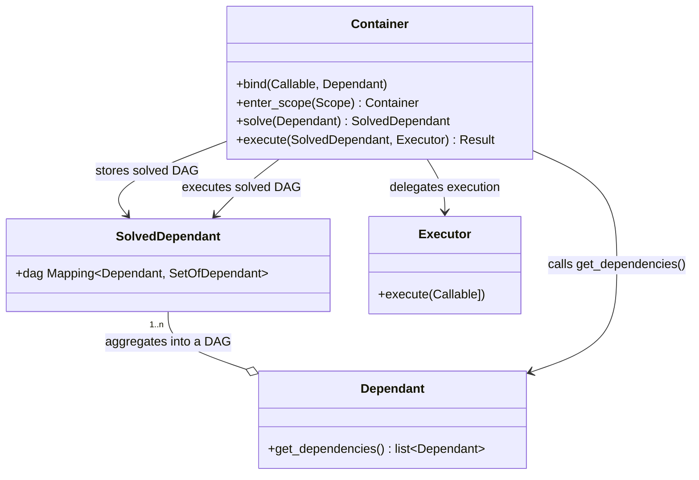

# Architecture

The fundamental design principle of `di` is to split up the complexity of dependency injection into smaller component parts:

- Wiring: when we discover the dependencies. This includes doing reflection (inspecting signatures), looking for dependency markers, etc.
- Solving: when we build an execution plan, taking into account cached values, binds, etc.
- Execution: when we execute dependencies, possibly doing IO, parallelization, etc.

We map these responsibilities to well defined classes/interfaces:

- Wiring: this is handled by [Dependant]
- Solving: this is handled by [Container]
- Execution: this is handled by [Executor]s

There are also some ancilliary support classes:

- [SolvedDependant] holds the result of a call to `Container.solve` that can be passed to `Container.execute_sync` or `Container.exeucte_async`.
- [ContainerState] holds the state of the container; abstracted away in `di.Container` but available in `di.container.ContainerBase`.

Fundamentally, our class diagram looks like this:

{ align=left }

The mermaid diagram used to create this is below.

[Dependant]: https://github.com/adriangb/di/blob/main/di/api/dependencies.py
[Container]: https://github.com/adriangb/di/blob/main/di/api/container.py
[Executor]: https://github.com/adriangb/di/blob/main/di/api/executor.py
[SolvedDependant]: https://github.com/adriangb/di/blob/main/di/api/solved.py
