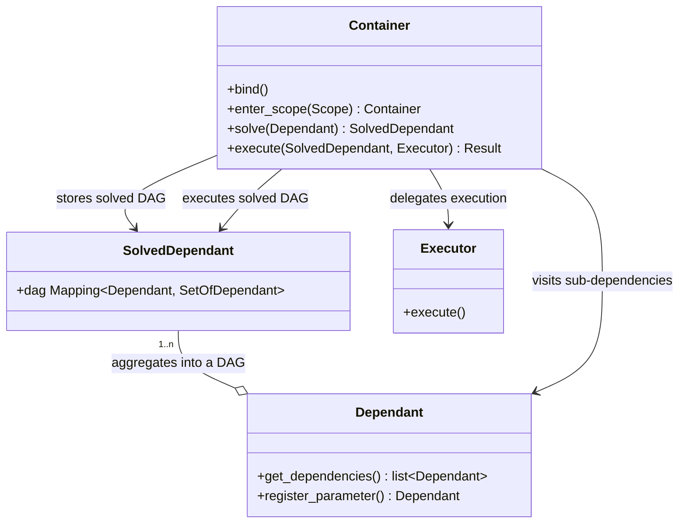

# Architecture

The fundamental design principle of `di` is to split up the complexity of dependency injection into smaller component parts:

- Wiring: when we discover the dependencies. This includes doing reflection (inspecting signatures), looking for dependency markers, etc.
- Solving: when we build an execution plan, taking into account binds.
- Execution: when we execute dependencies, possibly doing IO, parallelization, etc.

We map these responsibilities to well-defined classes/interfaces:

- Wiring: this is handled by [Dependant]
- Solving: this is handled by [Container]
- Execution: this is handled by [Executor]s

There are also some auxiliary support classes:

- [SolvedDependant] holds a reference of the result of solving (an executable DAG) that can then be executed at a later time.

Fundamentally, our class diagram looks like this:

Mermaid diagram source

 

[Dependant]: https://github.com/adriangb/di/blob/main/di/api/dependencies.py
[Container]: https://github.com/adriangb/di/blob/main/di/api/container.py
[Executor]: https://github.com/adriangb/di/blob/main/di/api/executor.py
[SolvedDependant]: https://github.com/adriangb/di/blob/main/di/api/solved.py
